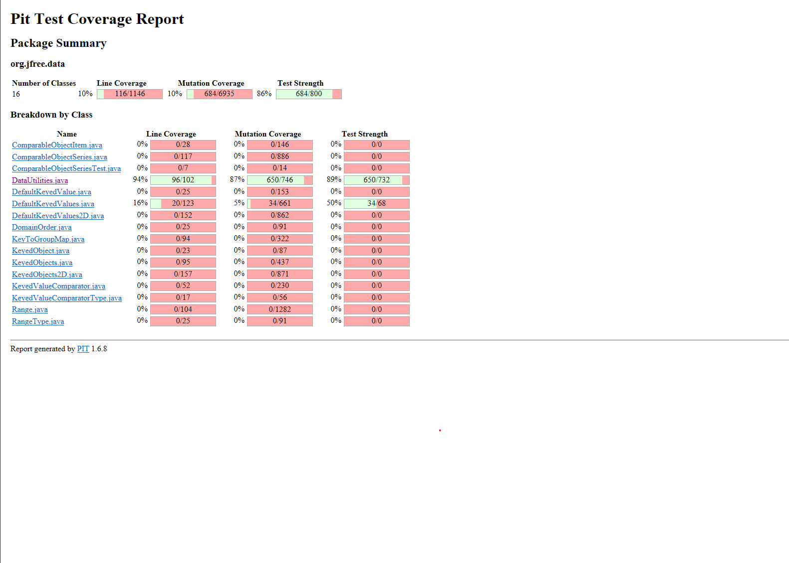
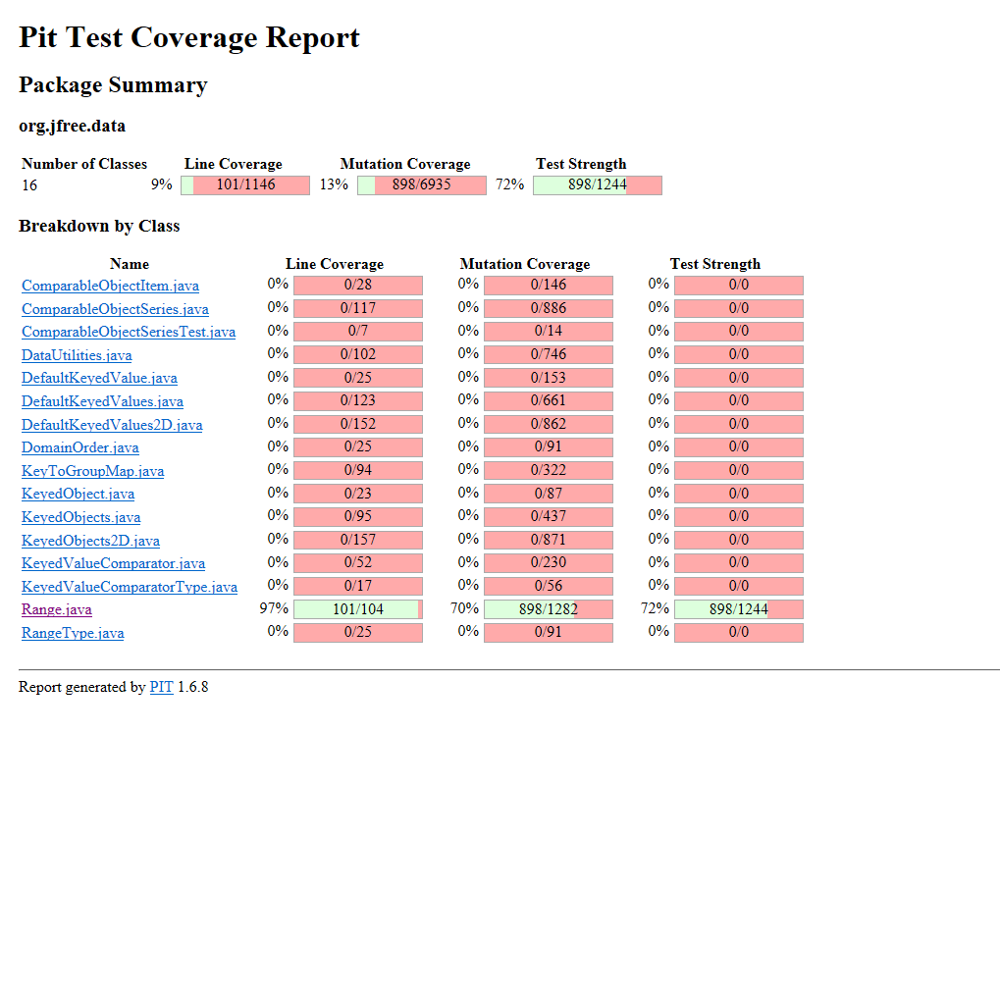
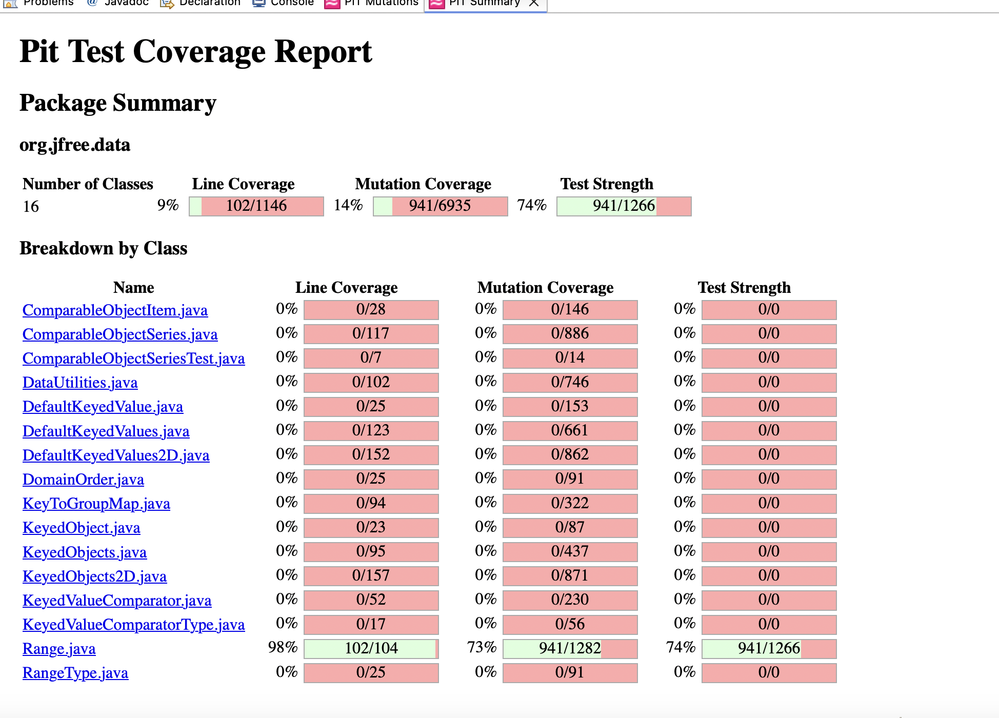
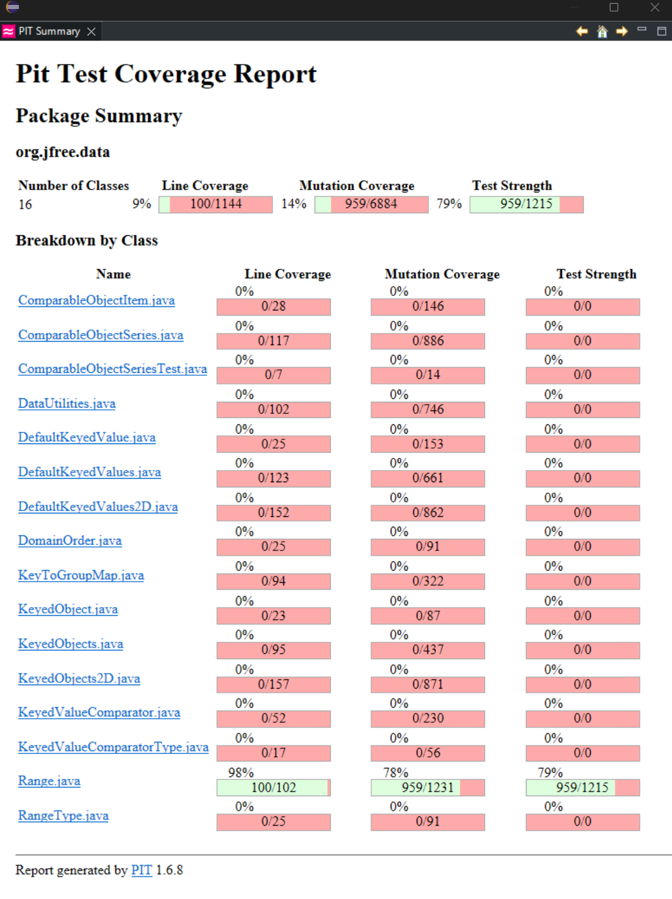

**SENG 637 - Dependability and Reliability of Software Systems**

**Lab. Report \#4 – Mutation Testing and Web app testing**

| Group \#:      |  11   |
| -------------- | --- |
| Student Names: |     |
| Steven Au      |     |
|Laurel Flanagan |     |
|Rhys Wickens    |     |
|Austen Zhang    |     |

# Introduction
This lab builds upon the foundation established in Assignment 3 by continuing the development of a comprehensive test suite for JFreeChart, a widely used Java chart library that enables developers to integrate professional-quality charts into their applications. The primary focus of this assignment is on mutation testing, refining and expanding the test suite to enhance its effectiveness in identifying potential faults within the JFreeChart codebase.

In addition to mutation testing, the second part of this lab explores GUI testing using Selenium. Specifically, the assignment involves developing and executing automated tests for the Amazon.ca website, evaluating its user interface and functionality. By leveraging Selenium’s capabilities, this section aims to assess key aspects of web automation testing and its role in ensuring a seamless user experience.

# Analysis of 10 Mutants of the Range class 

### 1. Method: `public Range(double lower, double upper)` 
Line(s) of Code: 
```java
if (lower > upper): 
String msg = "Range(double, double): require lower ("+ lower
 + ")<= upper (" + upper + ").";
``` 
**Mutant**: removed call to java/lang/StringBuilder::toString → SURVIVED 
**Analysis**: This mutant was not killed by the original test suite. This mutant survived because the original test cases only tested whether an exception is thrown when an invalid range is attempted to be created (a range with lower > upper) and the error message itself was not tested to check whether it contains the expected contents. A test needs to be added to check a part of the error message in addition to the exception to kill this mutant. 

### 2. Method: `public Range(double lower, double upper)` 
Line(s) of Code: 
```java
if (lower > upper): 
String msg = "Range(double, double): require lower ("+ lower
 + ")<= upper (" + upper + ").";
```  
**Mutant**: replaced call to java/lang/StringBuilder::append with receiver → SURVIVED  
**Analysis**: This mutant was not killed by the original test suite. This mutant also affects the construction of the error message for when an invalid range is attempted to be created, specifically related to the string concatenation of the message. Therefore, if the test doesn’t assert that the message is part of the exception (and only checks if the exception is thrown), this would not cause the test to fail. A test needs to be added to check whether the exact error message expected is received when creating an invalid range. 

### 3. Method: `public Range(double lower, double upper)` 
Line(s) of Code: 
```java
if (lower > upper): 
String msg = "Range(double, double): require lower ("+ lower 
+ ")<= upper (" + upper + ").";
```   
**Mutant**: Incremented (++a) double local variable number 1 -> SURVIVED  
**Analysis**: This mutant was not killed by the original test suite. This mutant increments the value of lower with the prefix operator, therefore when the value reaches the check if (lower > upper) within the constructor, the result may not be what is expected based on the original values of lower and upper. For example, if (9.0, 9.5) were passed to the Range constructor, this should be valid since lower is less than upper. But if lower is incremented due to the mutant on the line if (++lower > upper), then lower will be 10.0 and the expression will evaluate to true, and an Illegal Argument Exception would be thrown. Therefore, there needs to be a test case added that considers values of lower and upper close together such as 9.0 and 9.5 so that this mutant would be caught.  

### 4. Method: `public Range(double lower, double upper)` 
Line(s) of Code: 
```java
if (lower > upper): 
String msg = "Range(double, double): require lower ("+ lower
 + ")<= upper (" + upper + ").";
```  
**Mutant**: Decremented (--a) double local variable number 1 -> SURVIVED  
**Analysis**: Like the mutant above, this mutant was also not killed by the original test suite. This mutant decreases the value of lower with the prefix operator, so that when the value reaches the line with if (lower > upper), this is changed to if (--lower > upper). Therefore, if the values of (10.0, 9.5) are passed to the Range constructor, this should not be a valid range since lower is greater than upper. But with the decrement mutant, the expression evaluates 9.0 and 9.5, which results in false. This mutant also requires a test case where values of lower and upper are close together so that the decrement results in a different evaluation of the if statement.  
 
### 5. Method: `public double getCentralValue()`  
Line(s) of Code:
```java
 return this.lower / 2.0 + this.upper / 2.0;
``` 
**Mutant**: replaced double return with 0.0d for org/jfree/data/Range::getCentralValue → SURVIVED 
**Analysis**: This mutant was not killed by the original test suite. This mutant would make 0 the result returned, not matter what the lower and upper values of the range the method was called on were. In this case, this mutant survived because we only had one test case for the getCentralValue method, which was the example given in Assignment 2. This method was not chosen for writing tests in Assignment 2 and more tests were not required for this method to increase coverage in Assignment 3. In the one test that our suite did have for getCentralValue, it tests on the range (-1, 1), which the central value is 0. Therefore, this one test does not kill this mutant. In order to kill this mutant, we need to add a test case for a range that does not have a central value of 0.  

### 6. Method: `public boolean intersects(double b0, double b1)`
Line(s) of Code:
```java
if (b0 <= this.lower) {
    return (b1 > this.lower);
}
else {
    return (b0 < this.upper && b1 >= b0);
}
```
**Mutant**: changed conditional boundary → SURVIVED
**Analysis**: This mutant was not killed by the original test suite. In this case, there are two test cases which test the case where `b0 == this.lower` for the conditional statement `b0 <= this.lower`. Without mutating the conditional, the condition evaluates to `true`. The method then checks the condition for `b1 > this.lower` which evaluates to `true`. In the case that the conditional boundary is mutated by the mutant to evaluate the conditional `b0 < this.lower`, we find that our test case will evaluate to `false`. The method would move to the `else` block to check `(b0 < this.upper && b1 >= b0)`. This conditional returns `true` in our test cases. For these test cases, the method evaluates to `true` despite the change in conditional and does not expose the difference in behaviour due to the mutation. In order to kill this mutant, we would need to modify the existing test case (Test Case 16) where the `else` conditional produces a different result.

### 7. Method: `public boolean intersects(double b0, double b1)`
Line(s) of Code:
```java
if (b0 <= this.lower) {
    return (b1 > this.lower);
}
else {
    return (b0 < this.upper && b1 >= b0);
}
```
**Mutant**: Incremented (a++) double local variable number 3 → SURVIVED
**Analysis**: The third local variable refers to the first instance of `b1` in the above lines of code. This mutant was not killed by the original test suite for intersects. In the original test suite, Test Case 12 to 16 did not identify the behaviour of the mutant. For Test Cases 12 and 13, the ranges fully or partially overlap, so incrementing `b1` will always result in `true`. In Test Case 14 which tests for no overlap, for the selected values, incrementing `b1` does not change the return value which is `false`. For Test Cases 15 and 16, the ranges touch the boundaries, so the conditional statement for `b1 > this.lower` does not get evaluated and the resulting return value will be `true`. In order to kill this mutant, we would need a test case where incrementing `b1` changes the result. Adding a test case where `b1` is less than `b0` by one would expose the difference in behaviour.


### 8. Method: `public boolean intersects(double b0, double b1)`
```java
if (b0 <= this.lower) {
    return (b1 > this.lower);
}
else {
    return (b0 < this.upper && b1 >= b0);
}
```
**Mutant**: greater than to not equal → SURVIVED
**Analysis**: This mutant changes the conditonal statement for `b1 > this.lower` to `b1 != this.lower`. This relates to test cases where the conditinal statement `b1 > this.lower` is reached. In the original test suite which correspond to Test Case 15 - 17. In the original test cases, when the conditional for `b1 > this.lower` is reached, `b1` is not equal to `this.lower`. When the mutant is applied and changes the conditional statement to `b1 != this.lower`, the test case still evaluates to true and does not expose the differeing behaviour. In order to kill the mutant, a test case is needed where `b1 != this.lower` evaluates to false. 

### 9. Method: `public boolean equals(Object obj)`
```java
if (this == obj) { 
    return true;
}
```
**Mutant**: negated conditional → KILLED
**Analysis**: This mutant is killed by Test Case 29. In test case 29, we compare two instances of `Range` which evaluates to `false`. The conditional we are evaluation returns `false` because they are different `Range` objects. When the condition is applied and `this == obj` is negated and evaluates as `true`, the method returns `true`. In this case, the change in behaviour is detected, so it is killed by Test Case 29.

### 10. Method: `public boolean equals(Object obj)`
```java
if (!(obj instanceof Range)) {
    return false; 
}
```
**Mutant**: replaced boolean return with false for org/jfree/data/Range::equals → KILLED
**Analysis**: This mutant is killed by Test Case 33 which tests equality of an instance of `Range` with a null range. The `Range` object calls the `equals` method and passes `null` as the argument. `null` is not a Range object so the condition evaluates to `true` and the method returns `false`. The mutant changes this return value to `true`, and the method then returns `true`. Because this changes the return value, the change in behaviour is caught by the test case. This is generally applicable to most mutants in our suite which have the return value changed.


# Report all the statistics and the mutation score for each test class
## Before Adding Tests to Increase Mutation Score (Metrics with test suite from Assignment 3)
The following screenshots show the mutation score before adding tests to improve the score for the DataUtilities and Range classes. These metrics reflect the status of the mutation score based on the test suites from Assignment 3. 

**Data Utilities** 
 

**Range** 
 

As noted in the assignment instructions, the goal is to improve the mutation score by 10%. Therefore, since the Range class has mutation coverage of 70%, we aim to increase the mutation coverage to 80%. Since the DataUtilities class has mutation coverage of 87%, the aim would be to increase to 97%. It is noted that the coverage for DataUtilities is very high initially, and increasing to 97% may not be feasible due to equivalent mutants and other factors. This is discussed further below. 

## Mutation Tests In Progress (Intermediate Metrics) 
The following screenshots show the progress of improving the mutation score as more tests were added. 

**Data Utilities**  

Laurel to fill in 


**Range** 
After adding tests to cover methods that were not explicitly tested as part of Assignment 2 or 3, and a few additional tests to target specific mutants, the mutation coverage score was increased to 73%. This included tests to cover the constructor `Range(double lower, double upper)`, and the methods `getCentralValue()`, and `toString()`.  



Additional tests were added to specifically target many of the mutants associated with incrementing and decrementing variables. These tests were designed with variable values close together such that an increment or decrement of one value could lead to a different outcome. The mutation score for Range was increased to 78% at this point. 




## After Adding Tests to Increase Mutation Score (Final Metrics)

Laurel to fill in 


# Analysis drawn on the effectiveness of each of the test classes   
Based on the information provided in the previous section, the test suite for DataUtilities from Assignment 3 without additional test was already quite effective for killing mutants with a mutation coverage score of 87%. The test suite for Range was also relatively effective with a mutation coverage score of 70%. In Assignment 2, unit test cases were designed to be quite comprehensive based on equivalence class partitioning and boundary value conditions. Then in Assignment 3, the statement, branch and condition coverage were increased by adding additional test cases. Therefore, the test suite coming out of Assignment 3 was pretty robust, which is what lead to these initial scores for mutation coverage. 
 
 
Laurel to add more comments about final effectiveness 


# A discussion on the effect of equivalent mutants on mutation score accuracy
Equivalent mutants are mutants which are introduced to the original source code that are not detected by the test suite. In these cases, we can usually conclude that the test suite is inadequate to kill the mutants which were introduced. Equivalent mutants SURVIVE the mutation test, and must be manually inspected in order to evaluate the tests. In this exercise, we found that mutation testing helped us evaluate the quality of our test cases. In certain instances, modifying the input values to the test cases was enough to catch the mutation. Doing so required careful inspection of the code. In addition, mutation testing was found to be computationally intensive, taking several minutes before the coverage report was produced by PITest for our test suite. Due to this computational restriction, a careful approach was required of the programmer in order to identify test cases or modifications to test cases in order to kill mutants. However, in the case of equivalent mutants, the test suite would not be able to catch the mutant and must be excluded from the score calculation, otherwise the score can be distorted.

An equivalent mutant which survived the mutation test had to be evaluated against all the test cases which test the method of interest. This is an important step in identifying which tests actually reach the mutated statement. In order to identify solutions to kill surviving mutants, we had to identify the test cases which actually reach the mutated statement. Only then could you perform an analysis on how the mutant survived. It was found that test coverage alone does not mean you have a quality test suite. 

We also found that equivalent mutants can impact the mutation score accuracy by distorting the mutation score to give the impression that the test suite is less effective than it is in practice. A slow and careful process must be followed in order to review surviving mutants. Identifying equivalent mutants and excluding not only helps your mutation score truly reflect the quality of the test suite, but it also allows you to find the mutants which actually impact your test suite quality. This impact on the accuracy artificially deflates the mutation score, and additionally makes it more cumbersome for developers who are trying to kill the mutants that actually improve the test suite quality. By identifying and excluding equivalent mutants, the mutation score becomes more accurate and reliable, and becomes a better measurement of the true quality of your test suite.

# A discussion of what could have been done to improve the mutation score of the test suites
Austen to fill in 

# Why do we need mutation testing? Advantages and disadvantages of mutation testing
Mutation testing is a powerful technique used to assess the quality and effectiveness of a test suite. Traditional testing methods, such as unit and integration testing, focus on verifying whether software behaves correctly under expected conditions. However, these tests may not always reveal weaknesses in the test suite itself. Mutation testing helps address this by introducing small, deliberate modifications (mutants) to the code and evaluating whether the test suite detects these changes. If a test suite fails to identify these modifications, it indicates gaps in test coverage and effectiveness.

### Key Reasons for Using Mutation Testing:  
1. **Evaluates Test Suite Strength** – Mutation testing helps measure the effectiveness of a test suite by determining how well it can detect subtle errors or weaknesses in the code.  
2. **Identifies Redundant and Weak Tests** – It highlights test cases that are ineffective or redundant, allowing developers to refine or remove them.  
3. **Enhances Test Coverage** – By analyzing which mutants survive, developers can identify parts of the code that lack proper testing and improve overall coverage.  
4. **Finds Edge Case Vulnerabilities** – Mutation testing forces tests to validate edge cases that may not be covered by traditional testing methods.  
5. **Improves Code Quality and Reliability** – By ensuring that the test suite is capable of detecting small but significant changes, mutation testing contributes to higher software reliability.  

## Advantages of Mutation Testing  

- **High Test Effectiveness** – It systematically detects weak test cases and ensures the robustness of the test suite.  
- **Uncovers Hidden Defects** – Unlike traditional test coverage metrics, it evaluates how well the test suite finds actual faults, rather than just ensuring code execution.  
- **Encourages Better Test Design** – By exposing weaknesses, mutation testing promotes writing more meaningful and comprehensive test cases.  
- **Automated and Scalable** – With modern tools, mutation testing can be automated, making it feasible even for large projects.  

## Disadvantages of Mutation Testing  

- **Computationally Expensive** – Generating and testing mutants requires significant processing power, making it time-consuming, especially for large codebases.  
- **Difficult to Interpret Results** – Some surviving mutants may not indicate test weaknesses but instead suggest equivalent mutants (mutations that do not change program behavior).  
- **Requires Manual Effort** – While automation helps, analyzing and improving the test suite based on results still requires manual intervention.  
- **May Introduce False Positives** – Some mutants may not be realistic faults, leading to unnecessary modifications in the test suite.  

### Conclusion  

Despite its computational cost, mutation testing remains one of the most effective ways to assess and improve test quality. By exposing weaknesses in the test suite, it ensures that software remains reliable and resistant to subtle defects. While it should be used in combination with other testing strategies, its ability to measure test effectiveness makes it an essential tool in high-quality software development.  


# Explain your SELENUIM test case design process
Everyone to add a couple lines about your cases 

### **Test Case Design for Account Creation Functionality**
The test cases for account creation functionality aims to to test the account creation functionality. The main area that this test aims to improve is the validation checks for invalid user input.

1. account_creation_testAllEmptyFields
This test case was designed to test the validation of required fields during account creation when they are all left empty.

2. account_creation_testBlankNameValidEmailValidPassword
This test case was designed to test the validation of required fields when the name is left blank, and the rest of the fields have a valid input.

3. account_creation_testLetterAndNumbersInNameEmptyPassword
This test case was designed to test the validation of required fields when the name contains numeric characters and all other fields are left empty.

4. account_creation_testNumbersOnlyNameOtherEmptyFields
This test case was designed to test the validation of required fields when the name contains only numbers and all other fields are left empty.

5. account_creation_testValidAllFields
This test case was designed to test when all fields provided are valid.

6. account_creation_testValidAllUsingFakePhoneNumber
This test case was designed to test when all fields are provided and a fake phone number is used for the account email/phone number field.

7. account_creation_testValidAllUsingShortPhoneNumber
This test case was designed to test when all fields are provided but a phone number which does not meet North American phone number character length is provided.

8. account_creation_testValidNameInvalidEmailEmojiPasswordMeetsLength
This test case was designed to test when all fields are provided but the email does not contain an "@" character, and the password are emojis.

9. account_creation_testValidNameInvalidEmailLongPassword
This test case was designed to test when all fields are provided but the email is invalid and the password is very long.

10. account_creation_testValidNameInvalidEmailMatchingPasswords
This test case was designed to test when all fields are provided but the email is invalid and the passwords match.

11. account_creation_testValidNameInvalidEmailNoPassword
This test case was designed to test when all fields are provided but the email is invalid and no password is provided.

12. account_creation_testValidNameInvalidEmailPasswordDoesNotMatch
This test case was designed to test when all fields are provided but the email is invalid and the passwords do not match.

13. account_creation_testValidNameInvalidEmailSingleCharacterPasswordWithPasswordAgain
This test case was designed to test when all fields are provided but the email is invalid and the password is a single character.

14. account_creation_testValidNameInvalidEmailSpecialCharactersPassword
This test case was designed to test when all fields are provided but the email is invalid and the password contains special characters.

15. account_creation_testValidNameInvalidEmailValidPassword
This test case was designed to test when all fields are provided but the email is invalid and the password is valid.

### **Test Case Design for Login Functionality**
The test cases for account creation functionality aims to to test the login functionality. These test are designed to verify that unauthenticated users do not gain access to the system and that the observed message displayed corresponds to the expected behaviour.

1. login_testEmptyEmailField
This test case was designed to test the validation of the email field during login when it is left empty.

2. login_testInvalidAccount
This test case was designed to test the validation when an invalid account (email) is provided.

3. login_testInvalidAccountEnterKeyInput
This test case was designed to test the validation when an invalid account (email) is provided and the Enter key is used to submit the form.

4. login_testValidAccountEmptyPassword
This test case was designed to test the validation when a valid account (email) is provided but the password field is left empty.

5. login_testValidAccountValidPassword
This test case was designed to test the validation when a valid account (email) and valid password are provided.

### **Test Case Design for Gift Card Functionality**  
There are several different types of gift cards available on amazon.ca and also several options of actions that can be completed related to gift cards. The following is a summary of the test cases created for this functionality and the design process. All test cases were automated using Selenium with verification and assertion check points added to the scripts. 

1. gift_card_testGiftCardOptions   
This test case was designed to confirm the options available related to gift card functionality - including Amazon Gift Cards, Specialty Gift Cards, Redeem Amazon gift card, View your balance, and Amazon Reload. This test involves navigating to the Gift Card page through the main hamburger menu on the top left banner, with verifications along the way to confirm that the hamburger menu is present, and gift card is an option within the menu prior to clicking it. After navigating to the gift card page, this test includes assertions to confirm the presence of each of the options mentioned above that can be clicked by the customer depending on what they need to do related to gift cards. 

2. gift_card_testShopByAmazonEGiftCard   
This test case was designed to try shopping for gift cards based on specific selection criteria. The test data for this test case is an Amazon EGift Card, therefore it involves going through the same initial steps as first test to confirm the customer can navigate to the gift card page and that the Amazon Gift Card option is present. Then within the Amazon Gift Card Option, this test asserts the presence of the eGift Card option, which brings the customer to the page showing all eGift cards. 

3. gift_card_testShopByAmazonPhysicalGiftCard   
This test case was also designed to try shopping for gift cards based on specific selection criteria. The test data for this test case is an Amazon Physical Card, therefore it involves going through the same initial steps as first test to confirm the customer can navigate to the gift card page and that the Amazon Gift Card option is present. Then within the Amazon Gift Card Option, this test asserts the presence of the Physical Card option, which brings the customer to the page showing all Physical cards. 

4. gift_card_testShopByOccasionBirthday    
This test case was also designed to try shopping for gift cards based on specific selection criteria. The test data for this test case is a Birthday Amazon Gift Card, therefore it involves going through the same initial steps as first test to confirm the customer can navigate to the gift card page and that the Amazon Gift Card option is present. Then the test verifies that the Shop By Occasion section is present on the page for Amazon Gift Cards. Then within the Shop By Occassion section, this test asserts the presence of the Birthday option, which brings the customer to the page showing all Birthday cards. 

5. gift_card_test_ShopByOccasionCongratulations     
This test case was also designed to try shopping for gift cards based on specific selection criteria. The test data for this test case is a Congratulations Amazon Gift Card, therefore it involves going through the same initial steps as first test to confirm the customer can navigate to the gift card page and that the Amazon Gift Card option is present. Then the test verifies that the Shop By Occasion section is present on the page for Amazon Gift Cards. Then within the Shop By Occassion section, this test asserts the presence of the Congratulations option, which brings the customer to the page showing all Birthday cards. 

6. gift_card_test_ShopBySpecialtyGiftCardByBrandApple    
This test case was also designed to try shopping for gift cards based on specific selection criteria. The test data for this test case is a Specialty Gift Card for the Apple brand, therefore it involves going through the same initial steps as first test to confirm the customer can navigate to the gift card page and that the Specialty Gift Card option is present. Then the test verifies that the Top Brands section is present on the page for Specialty Gift Cards. Then within the Top Brands section, this test asserts the presence of the Apple option, which brings the customer to the page showing all Apple cards. 

### **Test Case Design for Gift Ideas Functionality**     
The gift ideas functionality on amazon.ca provides an option to search for gift ideas by filtering based on the characteristics of who the gift is meant to be for. It's possible to search based on gender and age ranges. The following is a summary of the test cases created for this functionality and the design process. All test cases were automated using Selenium with verification and assertion check points added to the scripts. 

1. gift_ideas_testGiftIdeasOptions     
This test case was designed to confirm the options available related to gift ideas functionality - including Gift Cards, Women, Men, Teens, Kids 8-12, Kids 4-7 and Babies. The test involves navigating to the gift ideas page using the option on the main banner, verifying it is present prior to selecting it, and then also verifying the presence of the "Who are you shopping for" text at the top of the gift ideas page. The test then asserts the presence of each of the options listed above for searching for gift ideas. 

2. gift_ideas_testGiftIdeasforMenHomeAndGarden     
This test case was designed to try shopping for gift ideas based on specific selection criteria. The test data for this test case is men and the home and garden category. Therefore, it involves going through the same initial steps to first confirm the customer can navigate to the gift ideas page, and verifying the presence of the men selection on the page. The test verifies that the text at the top of the page reads "Gifts for Men" after selecting men, and then asserts the presence of the Home & Garden option within the gifts for men. 

3. gift_ideas_testGiftIdeasforWomenTravel    
This test case was designed to try shopping for gift ideas based on specific selection criteria. The test data for this test case is women and the travel category. Therefore, it involves going through the same initial steps to first confirm the customer can navigate to the gift ideas page, and verifying the presence of the women selection on the page. The test verifies that the text at the top of the page reads "Gifts for Women" after selecting women, and then asserts the presence of the travel option within the gifts for women. 

4. gift_ideas_testGiftIdeasChangeAgeSelection     
This test case was designed to try changing the age selection after making an initial selection on the gifts page. The test data for this test case is women and girls 8-12. This test involves going through the same initial steps to first confirm the customer can navigate to the gift ideas page, the women selection on the page is present, and the text "Gifts for Women" appears on the page. Then this test verifies the presence of the Age Group menu, and verifies the presence of the age range 8-12 on this menu. After changing the age range to 8-12, the test asserts that the newly loaded page lists "Gifts for Girls 8-12" at the top. 

5. gift_ideas_testGiftIdeasChangeGenderSelection    
This test case was designed to try changing the gender selection after making an initial selection on the gifts page. The test data for this test case is women and anyone. This test involves going through the same initial steps to first confirm the customer can navigate to the gift ideas page, the women selection on the page is present, and the text "Gifts for Women" appears on the page. Then this test verifies the presence of the Gender menu, and verifies the presence of Anyone on this menu. After changing the gender to Anyone, the test asserts that the newly loaded page lists "Gifts for Everyone" at the top. 


# Explain the use of assertions and checkpoints
Austen to fill in 

# how did you test each functionaity with different test data
Steven to fill in, Austen to add some 

# How the team work/effort was divided and managed
Before starting the assignment, the team met to outline a plan for the required steps. Each team member completed the relevant setup required, such as cloning the github page, importing the Eclipse project, and installing Pitest for mutation testing, and downloading the required browser and installing extensions required for the GUI testing. 

For the mutation testing portion of the assignment, the work was divided among the team members based on their previous work with the DataUtilities and Range methods in Assignments 2 and 3. This was done so that addition of test cases to increase mutation scores could be more efficient based on familiarity with the class methods from previous assignments. Steven Au and Laurel Flanagan reviewed the initial mutation testing scores for the Range class, and took turns adding additional test cases to increase the mutation score. Steven and Laurel each completed analysis for 5 mutants for the Range class for the relevant report section. Rhys Wickens and Austen Zhang reviewed the initial mutation testing scores for the DataUtilities class, and took turns adding additional test cases to increase the mutation score. Reviews of the other testers test cases were completed within the pairs for quality checks. 

For the GUI testing, each team member designed test cases for 2 functionalities of the amazon.ca website as per the assignment instructions. The functionalities tested and the tester responsible are listed below. 

| Functionality                  | Tester          |
|---------------------------------|-----------------|
| Product Search                  | Rhys Wickens    |
| Shopping Cart                   | Rhys Wickens    |
| Gift Card                       | Laurel Flanagan |
| Gift Ideas                      | Laurel Flanagan |
| Sort Products by Price          | Austen Zhang    |
| Filter Products                 | Austen Zhang    |
| Login                           | Steven Au       |
| Account Creation                | Steven Au       |

The team reviewed the tests together, with each team member running all GUI tests on their own system and browser to identify discrepancies between results. This is also discussed further in the other sections.
The report was divided amongst the team members equally, with each member adding their relevant contributions to the appropriate sections.  

# Difficulties encountered, challenges overcome, and lessons learned

### Mutation Testing Challenges  

One of the primary challenges in the mutation testing was identifying why certain mutants were killed while others survived. Understanding whether a surviving mutant indicated a weakness in the test suite or an equivalent mutation (a mutation that does not change program behavior) required detailed analysis, which was time-consuming.  

Additionally, improving the mutation coverage was difficult because our test suite was already quite robust from the previous assignments. For example, the **Data Utilities** mutation test score was already at **87%**, leaving only a small margin for further improvement. Many of the remaining surviving mutants were equivalent mutations, making it nearly impossible to increase coverage further.  

### GUI Testing Challenges  

One of the main challenges faced during GUI testing was the inconsistency of how the Amazon.ca website appeared across different machines and browsers. Variations in screen resolutions, browser versions, and even minor updates to the website's UI sometimes caused tests to fail unexpectedly. Additionally, automating the login process posed difficulties due to dynamic elements, security features, and session handling, which required adjustments to our Selenium scripts.  

Another major challenge was the performance of Selenium when interacting with Amazon.ca. The tool often ran extremely slowly, causing recording sessions to lag or crash, making test execution frustrating and unreliable. This issue required multiple reruns and careful debugging to ensure test stability.  

### Lessons Learned  

From these challenges, several key lessons were learned:  

1. **Handling GUI Test Variability** – Cross-browser and cross-machine inconsistencies are an inherent challenge in GUI testing. Implementing explicit waits, ensuring element locators are as robust as possible, and testing across multiple environments early on can mitigate these issues.  
2. **Performance Considerations for Automated Testing** – Selenium can be slow on complex websites. Optimizing test execution by reducing unnecessary interactions, using headless browsers, and structuring test cases efficiently can improve reliability.  
3. **Understanding Mutation Testing Limitations** – While mutation testing is valuable, achieving 100% coverage is often unrealistic due to equivalent mutations. A balance must be struck between improving test coverage and recognizing diminishing returns.  
4. **Analyzing Surviving Mutants Effectively** – Interpreting mutation test results requires careful analysis. Understanding how different test cases interact with specific code changes is crucial for refining the test suite.  

Overall, these challenges provided valuable insights into automated testing complexities and reinforced the importance of designing robust, maintainable, and efficient test cases.  

# Comments/feedback on the assignment itself

Rhys to fill in 
